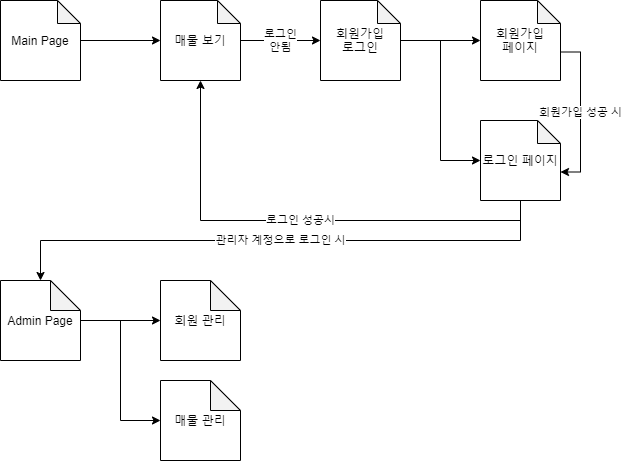

# 구상 D&C 홈페이지

---

## 1. Front-End

웹페이지에서 외관적으로 보이는 디자인, 애니메이션, 이미지 등을 만듦

### 1. 사용언어

현재 구상 중인 언어는 `pug`, `javascript`, 경우에 따라 `react` 를 사용할 예정이다.

### 2. 기획 및 페이지 디자인

기획과 페이지 디자인까지 맡는다면 기간이 더 길어질 수 있음. 기본적으로 원하는 기능과 간단한 페이지 레이아웃을 작성해 준다면 제작이 더 용이하며 제작 기간이 줄어듦.

---

## 2. Back-End

웹페이지에서 겉으로 보이는 부분을 제외한 서버, DB, 웹페이지 컨트롤 등을 만듦

### 1. 사용언어

서버사이드 언어로는 `nodejs`, 데이터베이스는 `mySQL` 을 사용할 예정이다.

### 1. 서버

현재 서버는 서버리스(serverless : 물리서버를 직접 설치하고 사용하는 것이 아니라 만들어져 있는 서버를 돈을 주고 사용하는 것)를 생각하고 있고 그 중 `AWS`(Amazon Web Service) 를 사용할 예정이다.

### 2. DB

DB 는 코딩 중에 사용언어가 바뀔 수 있으나 협업의 용의성에 따라 `mySQL` 을 생각하고 있다.

---

## 3. Front-End 계획

현재 구체적으로 정해진 기능이나 디자인이 없으므로 계획 수립이 불가.

### 1. 기본 사이트 레이아웃

기본 레이아웃을 [이 링크](https://www.jiptour.co.kr/) 로 생각하되 현재 견본 사이트는 완전한 반응형은 아님. 완전한 반응형으로 제작 가능함.(반응형은 페이지에 접근하는 디스플레이, 창 크기에 따라 유동적으로 바뀌는 디자인. [예시링크](https://www.apple.com/kr/))

## 4. Back-End 계획

### 1. 페이지 구성

### 2. 주요기능

1. 매물을 보여주는 페이지 : YouTube 의 링크를 통해 미리보기 지원
2. 관리자 페이지 : 매물을 등록하고 관리하는 페이지
